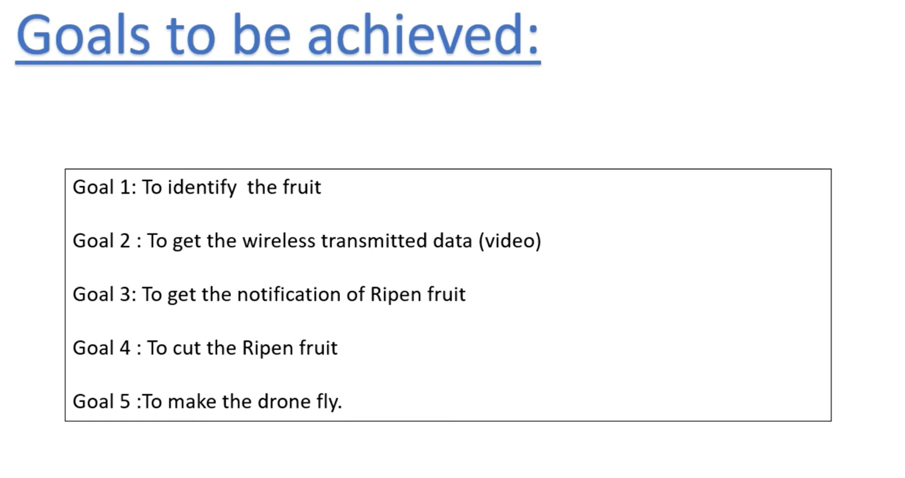
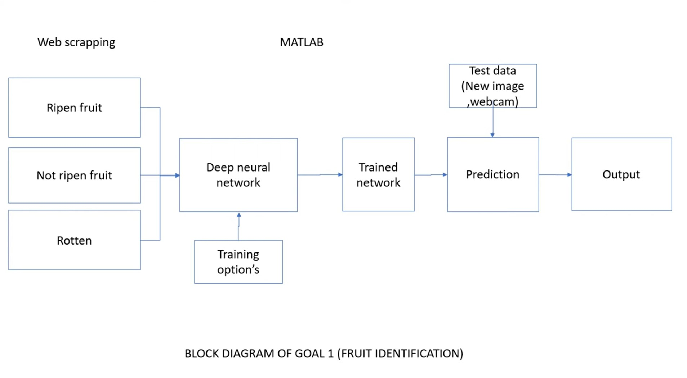
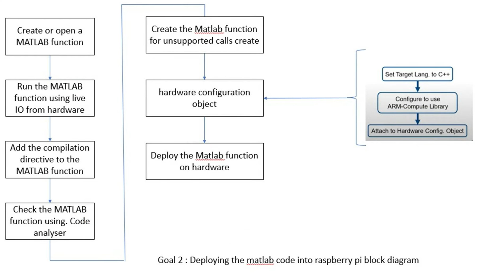
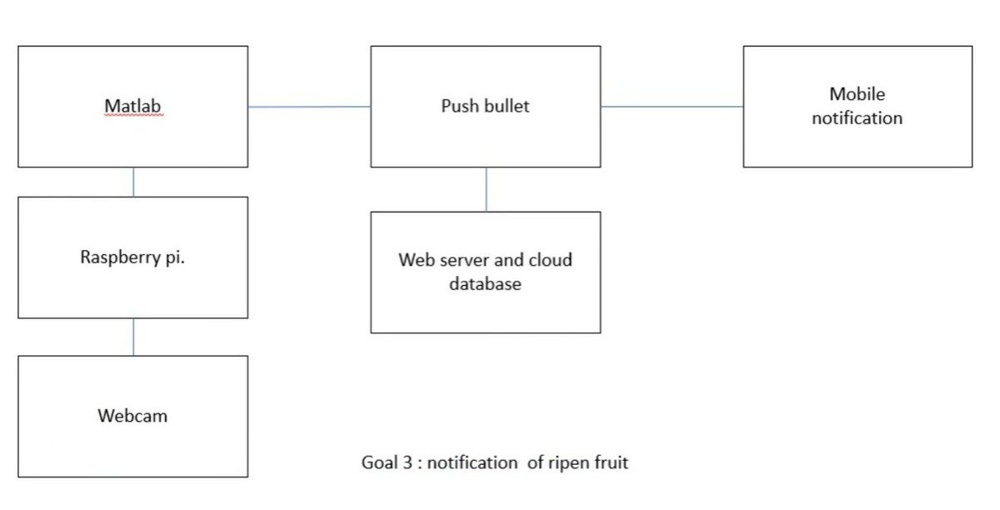
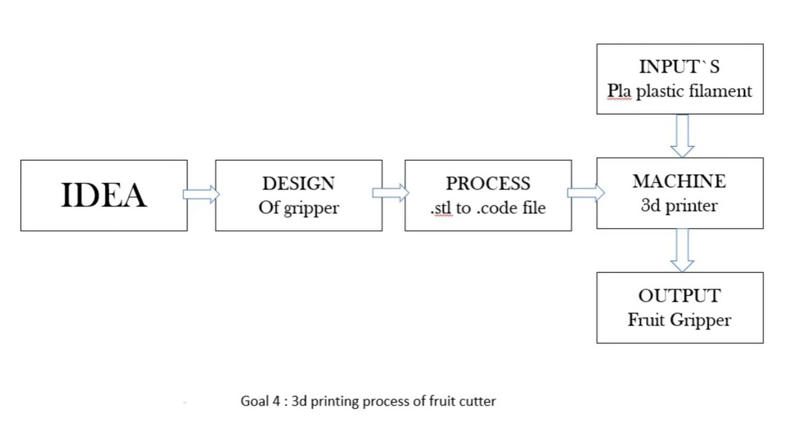
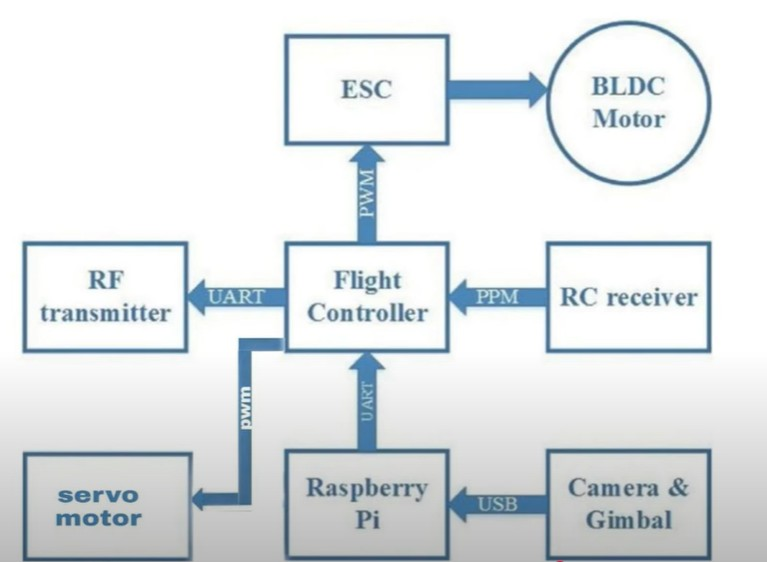
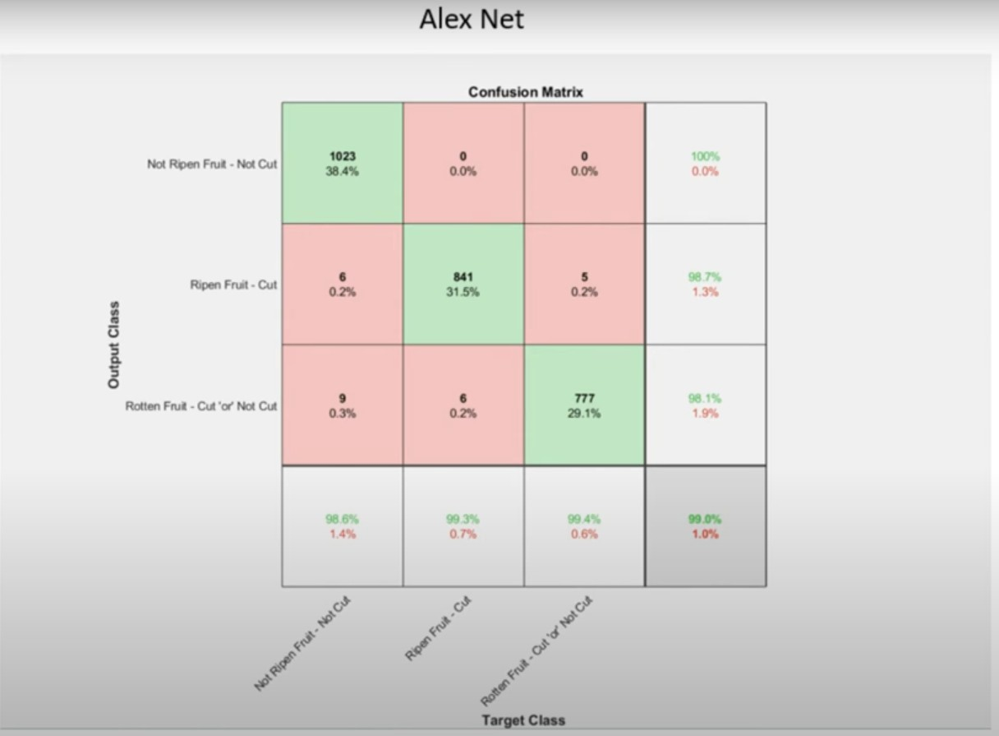
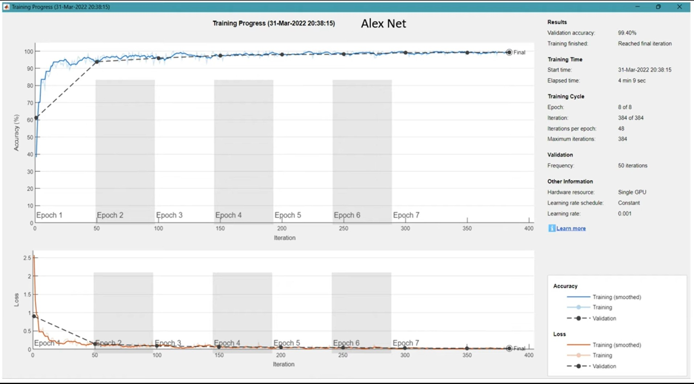

# 🚀 Robotic Fruit Picking

Welcome to the **Robotic Fruit Picking** repository! This project focuses on using machine learning models, integrated with a robotic system, to identify ripened fruits and automate the fruit-picking process with real-time notification and hardware deployment.

---

## Project Overview

- **Objective**: Identify ripened fruits using deep learning models and deploy a robotic arm to pick them.
- **Tech Stack**: MATLAB, AlexNet, Raspberry Pi, 3D printing, Deep Learning, Python, PushBullet API.
- **Tools Used**: 
  - Web Scraping for fruit data
  - Deep Neural Networks for classification
  - Hardware deployment for robotic actions

---

## Table of Contents

1. [Introduction](#introduction)
2. [Architecture](#architecture)
3. [Goals](#goals)
4. [Model Training and Testing](#model-training-and-testing)
5. [Results](#results)
6. [Future Work](#future-work)
7. [Acknowledgements](#acknowledgements)

---

## Introduction

This project explores the use of a deep neural network model (AlexNet) for identifying ripened fruits. The system integrates with a robotic system capable of picking fruits and sending notifications for ripened fruit.

---

## Architecture
The architecture consists of:
1. **Web Scraping**: Collect fruit images categorized as ripe, unripe, or rotten.
2. **Deep Learning Model**: Trains a neural network (AlexNet) on fruit images.
3. **Hardware Deployment**: The system uses Raspberry Pi to process data and send notifications.
4. **Notifications**: Ripened fruit notifications sent to mobile through the PushBullet API.

---

## Goals

*Figure: Block Diagram for Goal 1 - Fruit Identification.*

### Goal 1: Fruit Identification
- Web scraping of fruit images.
- Classify fruits using a trained neural network.

*Figure: Block Diagram for Goal 1 - Fruit Identification.*

### Goal 2: Deploying the Model to Hardware
- Use MATLAB to deploy the trained model to a Raspberry Pi for real-time fruit detection.

*Figure: Deployment of the model on hardware.*

### Goal 3: Mobile Notification
- Send real-time mobile notifications when the fruit is detected as ripe.

*Figure: Mobile Notification for Ripened Fruits.*

### Goal 4: 3D Printing of Fruit Cutter
- Design and 3D print a robotic gripper to pick fruits.

*Figure: CAD design for the fruit-picking gripper.*

### Goal 5: Drone System for Fruit Picking
- Integrate the robotic system with a drone to enable mobility for fruit picking.

*Figure: Drone system with integrated robotic arm for fruit picking.*

---

## Model Training and Testing

The fruit classification model is based on AlexNet. The model is trained on a dataset of images that are classified as ripe, unripe, or rotten.

- **Confusion Matrix**:
  
  *Figure: Confusion matrix of the AlexNet model showing accurate fruit classification.*

- **Training Progress**:
  
  *Figure: Training accuracy and loss progress over epochs.*

### Model Performance:

| **Parameter**       | **Value**  |
|---------------------|------------|
| Accuracy           | 99.18%     |
| Error Rate         | 0.82%      |
| Sensitivity        | 98.84%     |
| Specificity        | 99.41%     |
| Precision          | 98.66%     |
| Recall             | 98.84%     |
| F-Score            | 98.74%     |

*Table: Model Performance Metrics.*

---

## Results

The fruit classification model successfully identified ripened fruits with high accuracy. The robotic system, upon receiving the prediction, notifies the user and triggers the robotic arm for fruit picking.

### Key Results:
- **Training Accuracy**: 99.4%
- **Final Model Evaluation**: Achieved 98.74% F-score with high precision and recall.

---

## Future Work

- **Expanding Dataset**: Adding more diverse fruit types for improved generalization.
- **Hardware Integration**: Optimize hardware for faster processing and real-time operations.
- **Mobile App Integration**: Build an app to monitor the system and send notifications.

---

## Acknowledgements

Special thanks to:
- **MATLAB** for neural network training and hardware deployment.
- **Raspberry Pi** for integrating with real-time systems.
- **PushBullet API** for seamless mobile notifications.

---

👋 **Thank you for exploring this repository!**
